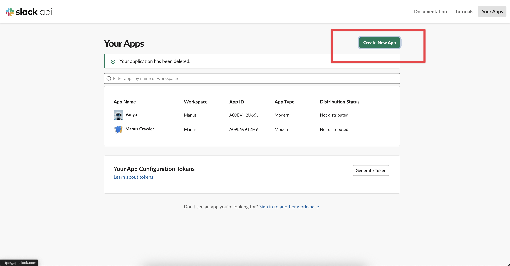
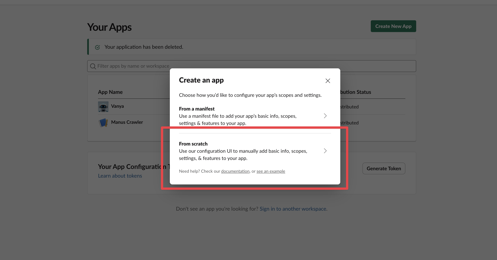
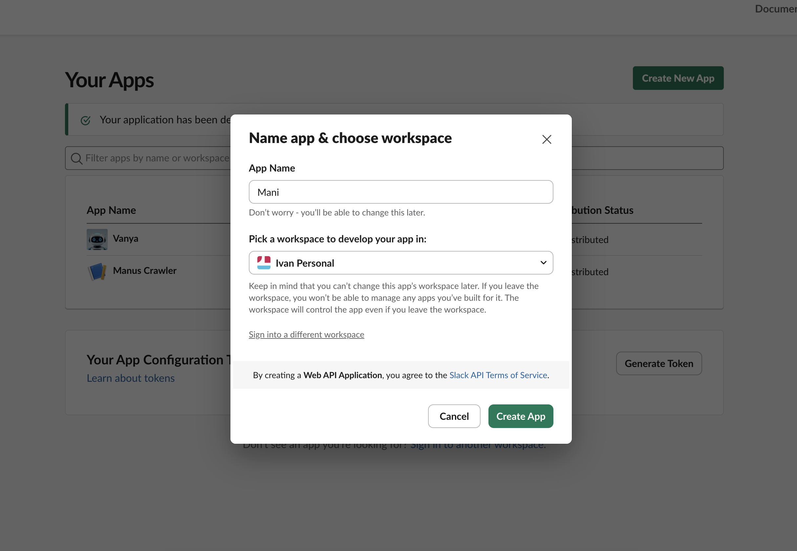
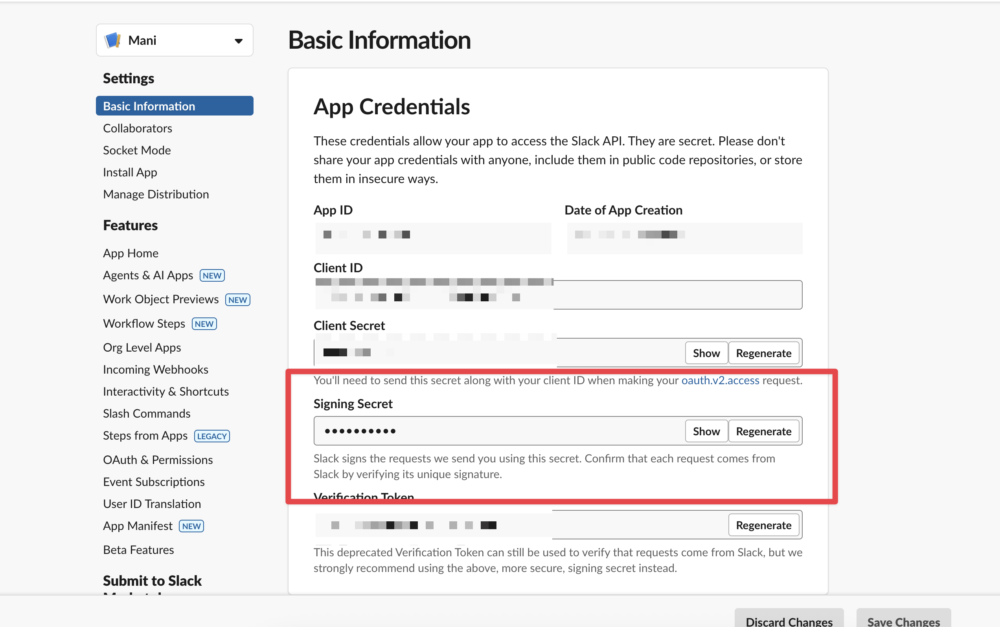
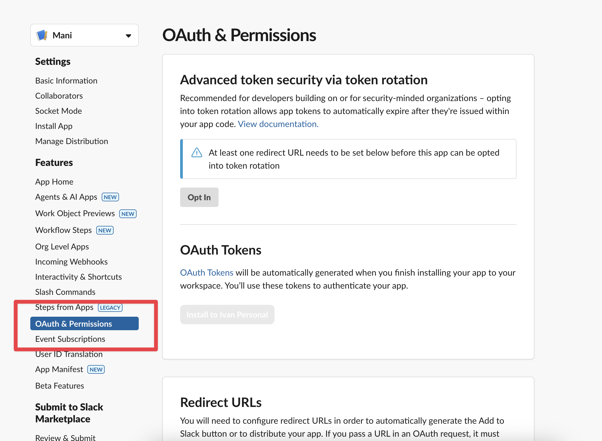
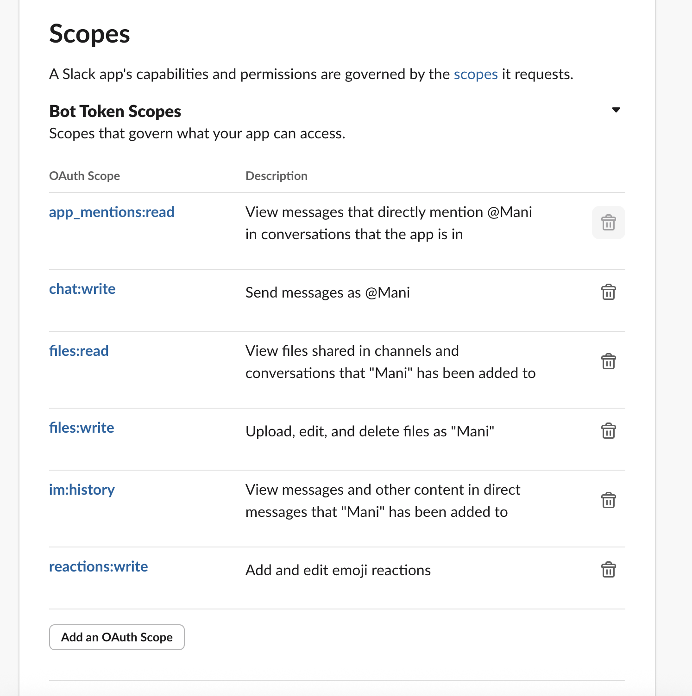
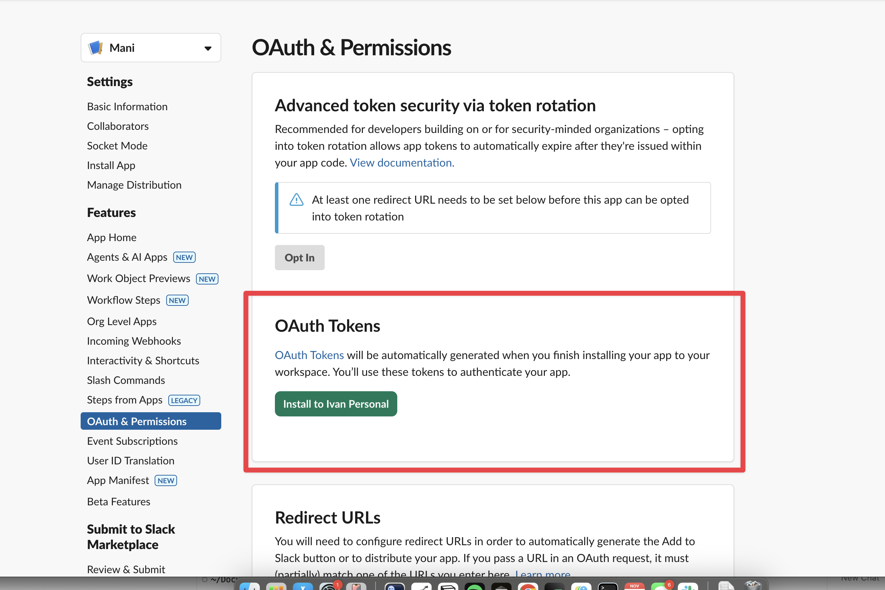
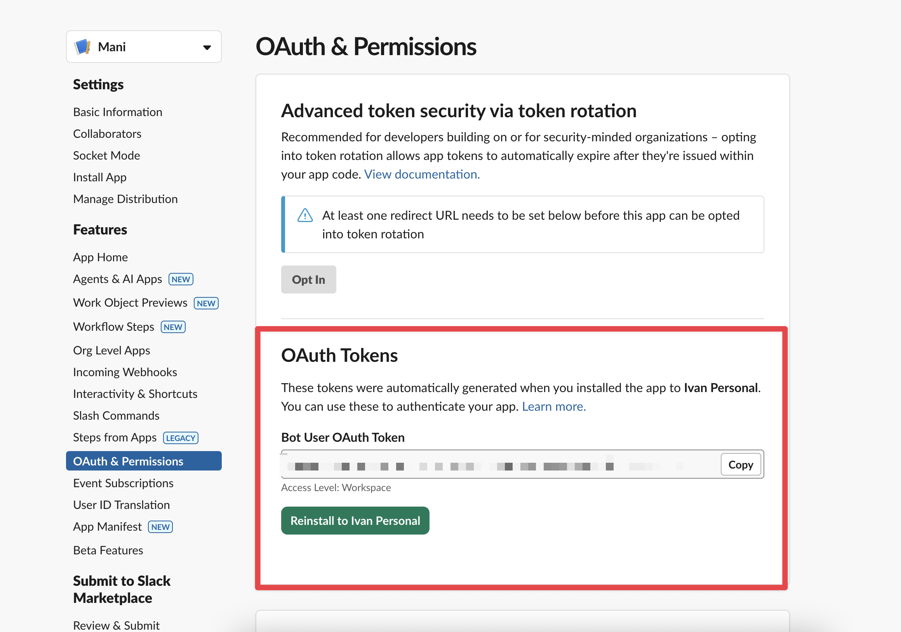

# Manus API Workshop

Welcome to the Manus API workshop. This repository provides a structured, hands-on guide to building complex workflows with the new Manus API.

The workshop is divided into four foundational notebooks and a final capstone project.

1. API Fundamentals: This notebook covers the core mechanics of the Manus API. You will learn how to authenticate, create tasks, poll for their status, and interpret the results.

2. File Handling: Here you'll learn how to work with files in the Manus API so that your agent has the data it needs to reason effectively.

3. Webhooks: Polling doesn't work at scale. Learn why webhooks are a useful tool to implement here which will allow you to listen for task completion events.

4. Integrating with Slack: In this notebook, you'll learn the fundamentals of the Slack API and build the foundation for a conversational bot using FastAPI and Modal.

5. Building a Support Bot: The final project ties all the concepts together. You'll build a deployable support agent that can process file uploads from Slack and create structured entries in a Notion database.

## Setup

> Make sure that you've signed up on [Manus](https://manus.im/app#settings/integrations/api) and obtain an API key. Our documentation is available at [open.manus.ai/docs](https://open.manus.ai/docs).

1. First, install the requirements for this project. We recommend [uv](https://docs.astral.sh/uv/getting-started/installation/) for this tutorial to manage dependencies.

```bash
uv venv
source .venv/bin/activate
uv sync
```

2. Then, make sure that you update the `.env` file with your MANUS_API_KEY.

```
MANUS_API_KEY=<API KEY GOES HERE>
```

3. Go through our Slack Setup instructions below and update your env with the new slack signing secret and the bot token.

```
# Manus API Configuration
# Get your API key from: https://manus.im/settings/api-keys
MANUS_API_KEY=sk-
# Get your Slack API Key from https://api.slack.com/apps 
SLACK_BOT_TOKEN=
SLACK_SIGNING_SECRET=
```

## Slack Setup

To connect your agent to Slack, you will need to create a Slack App. By the end of this process, you'll get a Bot Token and a signing secret. 

First, you'll need to create a slack app by going to the [Slack Dashboard](https://api.slack.com/apps) and creating a new App.  

This process will give you the two essential credentials our bot needs to operate: a Bot Token (to authenticate with the Slack API) and a Signing Secret (to verify that incoming requests are genuinely from Slack).

1. First, create a new App by clicking on the `Create App` button on the main page



2. Then you'll want to select the from scratch option



3. Lastly, once you've decided on the name for your slack bot, you can then create the application



4. This will then provide you with a set of App Credentials. You can then grab your signing secret from the Basic Information page and then copy it to the `SLACK_SIGNING_SECRET` variable in your `.env` file



5. Then you need to provision your bot token. Navigate to `OAuth & Permissions` in the left sidebar 



Then in the **Bot Token Scopes**, click **Add an OAuth Scope** and make sure to add the following scopes

- app_mentions:read: To see messages that @mention your bot.
- chat:write: To post messages in channels.
- files:read: To access files shared in channels where the bot is a member.
- im:history: To read direct messages sent to the bot.
- files:write: To write files to channels where the bot is a member.
- reactions:write: Add and edit emoji reactions



6. Lastly, you should then install this new app into your workspace



7. Once you've installed this application into your workspace, you'll be redirected back to the same page where you'll have a bot token that you can copy under the **Bot User OAuth Token**, this should be saved under the `SLACK_BOT_TOKEN` in your `.env` file.



## What You'll Build

By the end of this workshop, you'll have put together a simple agent which:

1. Automatically analyzes incoming support tickets
2. Processes user descriptions and screenshots
3. Generates structured reports in your knowledge base

